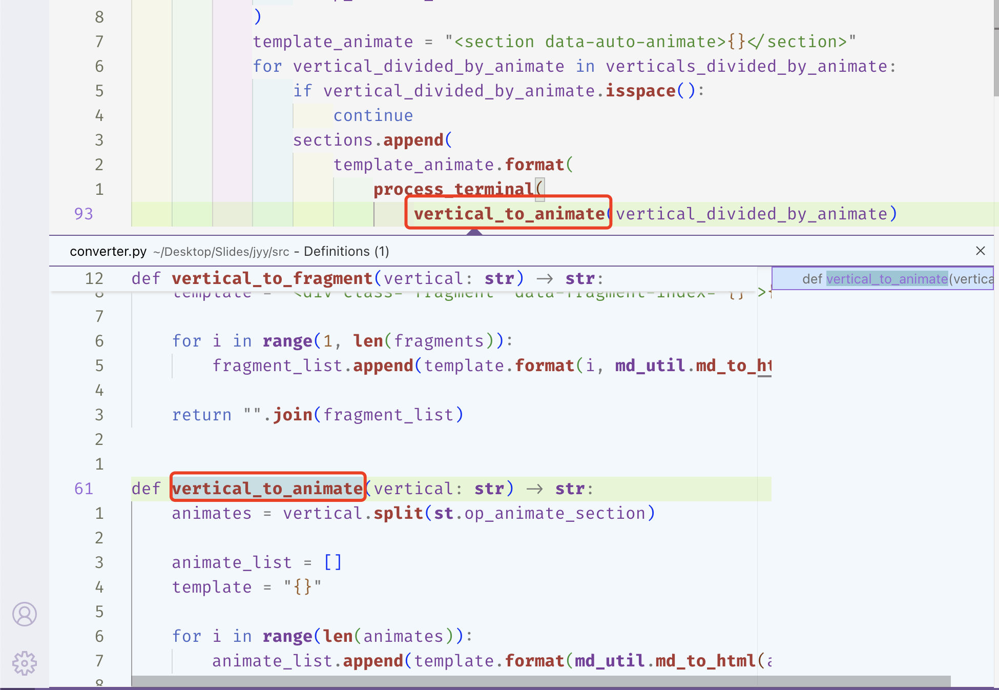
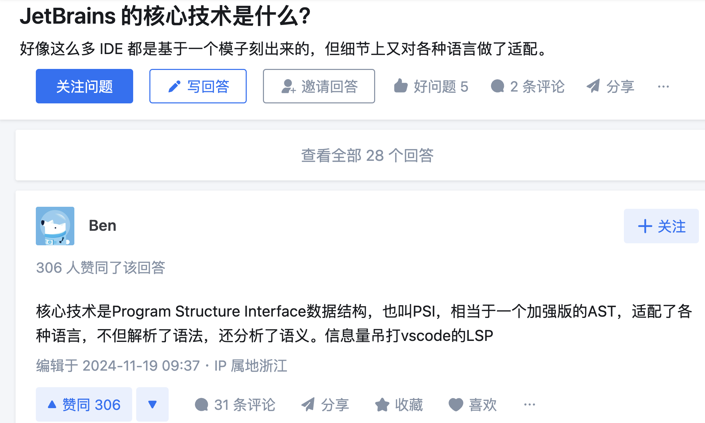
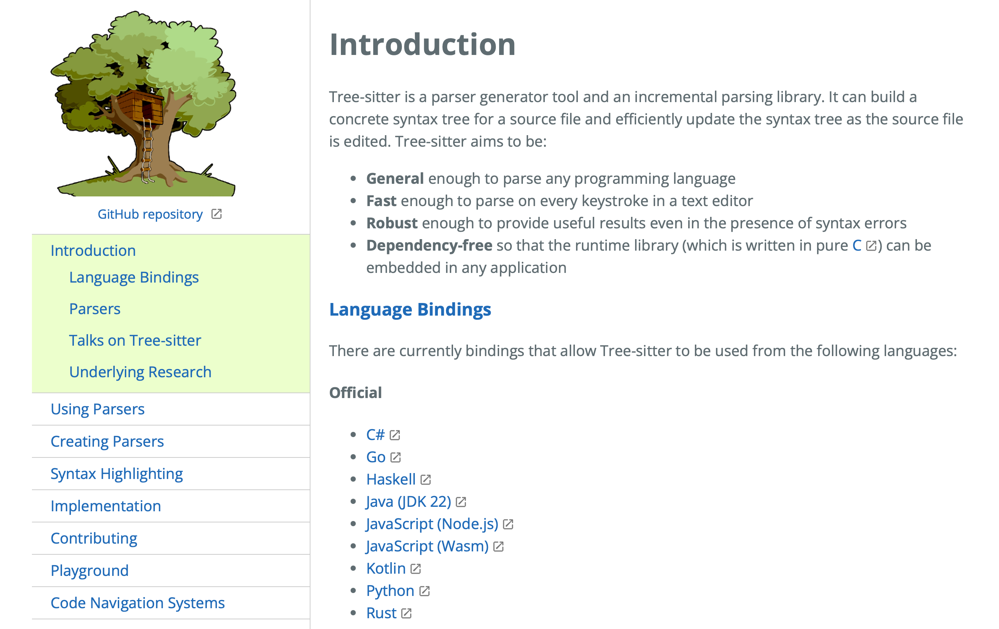

  author:
    name: 詹奇
    url: http://qi-zhan.github.io
+++++

# Better Together

----

## 动机: 程序语义的轻量级分析

- 找到函数的定义/给大模型提供精准输入
    - 需要确定变量的 def-use 关系
```python
a = 1
def a():
    pass

print(a) #  哪个a被打印？
```
--
- 重构代码: `rename` 变量 `a` 为 `b`，得到重构后的代码
```python
b = 1
def b():
    pass

print(b)
```

----

## 更多例子

- Java 找到函数/变量的定义/rename ➡️ 确定 def-use 关系
--
- Rust 代码补全 ➡️ 获得当前变量可使用的方法  ➡️ 获得变量的类型
--
- C++ 分析 API 的使用情况 ➡️ 找到调用函数的源代码
--
- Python 确定库中的函数是否会被调用 ➡️ Find References
- ...
> 在软工科研工作中, 在很多问题是需要对程序<red>语义</red>而不仅仅是<red>语法</red>的分析才能完成的
--

<center>那么, 如何实现这些功能呢？</center>

----

## 尝试1.1: 自己写 (瞎写)

- 基于正则表达式+奇怪的字符串处理+AST语法
    + 在数据集上没出问题就算成功 👀
--
- 不是一个好选择
    + <del> 写的大概率是错的 </del>
        + 既不 sound 也不 complete
    + 对这个实现有所怀疑 :(

----

## 尝试1.2: 自己写 (好好写)

- 这些不过是编译器前端的基础分析罢了
    + 我们完全可以基于 AST 自己做类型检查, 语义分析
--
- 一个“真正”的语言太过复杂了
- 每个语言都要自己写一遍

>  <center>“浪费”宝贵的科研时间</center>

--

为什么要自己写呢？

----

## 尝试2: 从编译器/解释器中“偷”信息

> 编译器一定实现过这些功能, 我们把这些信息导出来就完了.
--

- C/C++: Clang Plugin
    - 有相当不错的官方文档
    - 需要写 C++ 和大量对于 API 的了解
    - 某同学: ** 才写 Clang
--
- Rust: <https://github.com/cognitive-engineering-lab/rustc_plugin>
    - 非官方; 同样需要写 Rust 和大量对于 API 的了解
--
- 更多的语言: 压根没有接口, 总不可能为了一个插件改编译器吧

> 我们其实只要一些很轻量级的语义信息, 就像我们在写代码时
> <red> IDE 给我们的提示</red>一样

----

## 尝试3: 从 Language Server “偷”信息

> The Language Server Protocol (LSP) defines the <red>protocol</red> used between an editor or IDE and a language server that provides language features like <red>auto complete, go to definition, find all references etc </red>.

<center></center>

----

## 自然的好处

- LSP 是一个通用的协议
    + 一个“正常”的语言一定有人实现
    + 多个语言可用

----

## 尝试4: PSI?



---

## 新的问题

> 🧑‍💻: `a.py` 文件第 1 行第 14 列的定义?
--
> 🤖: 在 `b.py` 文件第 2 行第 10 列至第 14 列.
--

1. 奇怪的输入: 为啥要用行列号?
2. 奇怪的输出: 为啥只给一个行列号?
--

- 当然我们可以去解析源文件来**构造输入** 和 **解析输出**
    + 更本质的问题是: 我们最终只能得到一个字符串
--

+ 如果我们想要函数的定义位置, 返回一个函数的名字并没有用
    + 最好有一种数据结构
    + 需要整个函数体的<red>AST</red>

----

## AST 🌲 + LSP 🤖

<div class="mul-cols">
    <div class="col">
🌲: AST.Node ➡️ Position
```
├─import_from_statement:
│ ├─from
│ ├─dotted_name: a [0,5:0,6]
│ │ └─identifier: a [0,5:0,6]
└─expression: k() [2,0:2,3]
   └─call: k() [2,0:2,3]
       ├─identifier: k [2,0:2,1]
       └─argument: () [2,1:2,3]
           ├─(
           └─)
```

🌲: [Position] ➡️ [AST.Node]

```
call: k() [2,0:2,3]
```

    </div>
    <div class="col">
🤖: Positoin ➡️ [Position]

```json
{
    "file": "b.py",
    "row": 2,
    "col": {
        "start": 0,
        "end": 3
    },
}
```
    </div>
</div>

----

## Tree-sitter

> 那么我们该如何获得 AST 呢?



- 一股靠谱的气息, 多语言可用, 可用于多语言

---

## Tree-sitter API 不够友好 🤔

```python
def foo():
    if bar:
        baz()
```
--
理想: 像使用 Python AST 一样

```python
assert isinstance(root_node, Module)
function_node = root_node.body[0] # type: FunctionDef
assert isinstance(function_node, FunctionDef)
assert function_node.name == 'foo' # type: str
```
--
现实: 不知道这个 `Node` 是什么, 有哪些 `Field` 可以用
```python
assert root_node.type == 'module'
function_node = root_node.children[0]
assert function_node.type == 'function_definition'
assert function_node.child_by_field_name('name').type == 'identifier'
```

----

## 当然这也不是 Tree-sitter 的问题

- 其本质上是用纯 C 写的
    + 有各个语言的 binding 就不错了
--

- 所以我们可以自己做一个更友好的 API
    - 要不就叫 Tree-prettier
--
- 其实也没什么难的
    + 真.代码生成
    + 我们需要实现一个程序, 读入 tree-sitter 的语法描述, 输出 Python 类的设计
    + 已经有 Haskell, Rust 的实现了

----

## 🧑‍💻 + 🌲 + 🤖

用户:

- 在 Python 层面操作 “友好” 的 AST
    + 发出请求 (例如得到函数的定义)
--
框架:

2. “友好” 的 AST 转换为 Tree-sitter 的 AST
3. Tree-sitter 的 AST 转换为 LSP 的 Position
4. 通过 LSP 协议得到 Position 结果
5. Position 结果转换为 “友好” 的 AST 结点

----

## 更多的用途?
