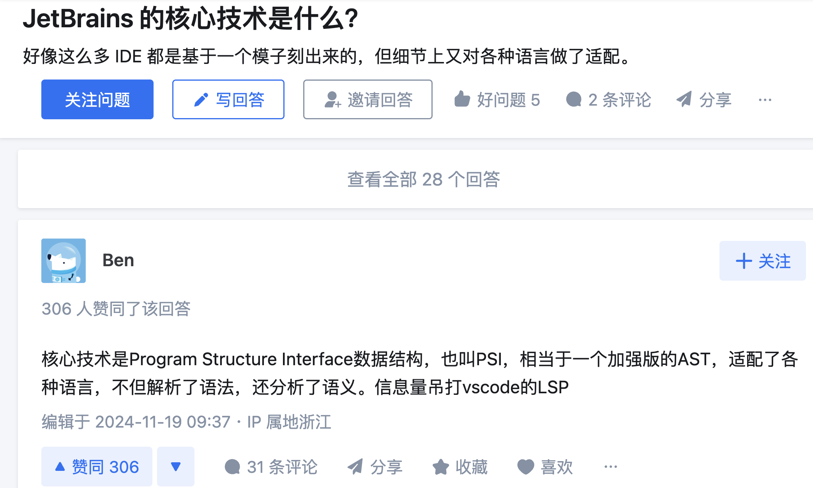

  author:
    name: 詹奇
    url: http://qi-zhan.github.io
+++++

# Better Together

----

## 动机: 程序语义的轻量级分析

- 需要确定变量的 def-use 关系
    + 找到函数的定义/给大模型提供精准输入
```python
a = 1
def a():
    pass

print(a) #  哪个a被打印？
```
--
- 重构代码
    + 上述代码中 `rename` 变量 `a` 为 `b`，需要确定哪些地方需要修改
--
- 获得当前使用变量的类型
    + (获得可使用的方法) ➡️ 代码补全
--

> 那么, 如何实现这些功能呢？

----

## 尝试1: 自己写

- 这些不过是编译器前端的基础分析罢了
    + 我们完全可以基于 AST 自己做类型检查, 语义分析
--
- 不是一个好选择
    + 一个“真正”的语言太过复杂了
    + 每个语言都要自己写一遍
    + <del> 写的大概率是错的 </del>

----

## 尝试2: 从编译器/解释器中“偷”信息

> 编译器一定实现过这些功能, 我们把这些信息导出来就完了.
--

- C/C++: Clang Plugin
    - 有相当不错的官方文档
    - 需要写 C++ 和大量对于 API 的了解
    - 某同学: ** 才写 Clang
--
- Rust: <https://github.com/cognitive-engineering-lab/rustc_plugin>
    - 非官方; 同样需要写 Rust 和大量对于 API 的了解
--
- 更多的语言: 压根没有接口, 总不可能为了一个插件改编译器吧

> 我们其实只要一些很轻量级的语义信息, 就像我们在写代码时
> <red> IDE 给我们的提示</red>一样

----

## 尝试3: 从 Language Server “偷”信息

> The Language Server Protocol (LSP) defines the <red>protocol</red> used between an editor or IDE and a language server that provides language features like auto complete, go to definition, find all references etc

----

## 自然的好处

- LSP 是一个通用的协议
    + 一个“正常”的语言一定有人实现
    + 多个语言可用

----

## 尝试4: PSI?



---

## 新的问题

> 🧑‍💻: `a.py` 文件第 1 行第 14 列的定义?
--
> 🤖: 在 `b.py` 文件第 2 行第 10 列至第 14 列.
--

1. 奇怪的输入: 为啥要用行列号?
2. 奇怪的输出: 为啥只给一个行列号?
--

- 当然我们可以去解析源文件来**构造输入** 和 **解析输出**
    + 更本质的问题是: 我们最终只能得到一个字符串
--

+ 如果我们想要函数的定义位置, 返回一个函数的名字并没有用
    + 最好有一种数据结构
    + 需要整个函数体的<red>AST</red>

----

## AST 🌲 + LSP 🤖

<div class="mul-cols">
    <div class="col">
🌲: AST.Node ➡️ Position
```
├─import_from_statement:
│ ├─from
│ ├─dotted_name: a [0,5:0,6]
│ │ └─identifier: a [0,5:0,6]
└─expression: k() [2,0:2,3]
   └─call: k() [2,0:2,3]
       ├─identifier: k [2,0:2,1]
       └─argument: () [2,1:2,3]
           ├─(
           └─)
```

🌲: [Position] ➡️ [AST.Node]

```
call: k() [2,0:2,3]
```

    </div>
    <div class="col">
🤖: Positoin ➡️ [Position]

```json
{
    "file": "b.py",
    "row": 2,
    "col": {
        "start": 0,
        "end": 3
    },
}
```
    </div>
</div>

----

## 🧑‍💻 + 🌲 + 🤖

----

## 系统设计

