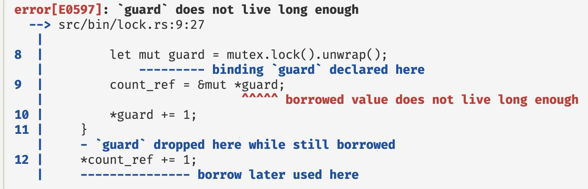

  author:
    name: 詹奇
    url: <https://qi-zhan.github.io/>

+++++

# 系统开发实践第三次课

----

## 自我介绍

+ 詹奇: <red>二</red>年级博士生
+ ✉️ qizhan@zju.edu.cn
+ 🏠 <https://qi-zhan.github.io/>
+ 研究方向: 软件分析/测试/验证/<del>AI</del>的应用
+ 常年本课程助教 (第<red>三</red>年😱)

> 欢迎在课上/后与我讨论

----

## 本次课程安排

<del>由于各种原因, 我来上这次课</del>

+ 作业讲解与答疑
    - 第一次
    - 第二次
    - <red>第三次?</red>
+ Rust 比较学习
+ Rust 科研实践
+ ... <del>总要到一定时间才能下课⏱️</del>

---

# 一个不有趣的彩蛋

----

## 幻灯片制作

<center><https://github.com/Qi-Zhan/jyyslide-md></center>

- 一个简单的需求
    - 每次保存 `markdown` (源文件)的时候, 自动渲染 `HTML`.
    - 一个命令行工具: 每次文件系统更改, 执行某个指令
--
- 你觉得需要几行/多少时间?
    - Python Or Rust?

----

## Python vs. Rust

- Python
    - `watchdog` + `argparser`
--
- Rust
    - `notify` + `clap`

---

# 作业讲解

----

## 平平无奇的第一次作业

----

## 稍有难度的第二次作业

----

## 有些难度的第三次作业

> 可以开始做了... ⏱️

---

# Rust: Why and How?

----

## 比较学习

- 编程语言理论基础 theory
- 系统编程实践经验 system

- 独特性
    + ownership
    + trait

----

## 内存安全

> 指针和引用总是指向具有正确类型的对象

```c
int *foo(int v) {
  int *ptr = (int *) malloc(sizeof(int));
  int err = initialize_int(ptr,v);
  if (err != 0) free(ptr);
  return ptr;
}

void bar() {
    int *p = foo(42);
    *p ... // wild pointer
    free(p); // double free
}
```

----

## 历史的解决方案

- 通过动态垃圾回收来自动回收
    + 解放程序员
    + Java
--
- 通过系统但不强制的编程准则
    + 对程序员要求有点高
    + 大多数漏洞的来源
    + C/C++
--
- ???
    + Rust

----

## 自动垃圾回收

- 内存自动释放, 勿需开发者考虑 😍
    + 再也用不到的对象可以安全释放
- 不允许指针运算
    + 引用即指针
    + 保证程序不会计算得到 GC 无法控制的指针
- 检查数组的下标运算
    + 越界就报错
- 优势: 内存安全 😄
- 劣势: 有点慢 😂
    + 检查很昂贵
    + GC 有些耗时 (无法预料)

----

## 程序员来管控内存


<!-- <div class="mul-cols">
<div class="col">

谁来释放内存?

</div>
<div class="col"> -->

```c
void my_func() {
    int *ptr = (int *) malloc(sizeof(int));
    *ptr = 42;
    api_call(ptr)
}
```

- `api_call`, `my_func` 都拥有指针

> 自然的问题: 谁来释放内存?

<!-- </div>
</div> -->

----

## 所有权准则

- 大规模系统的设计者总是需要讨论一个系统性的内存管理规则
    + 谁负责释放内存

- 所有权规则是最受欢迎的方法
    + 一个指针是一块分配内存的所有者
    + 每块内存都有唯一的所有者
    + 所有者且只有所有者负责释放内存
    + 并不强制使用所有权机制编程
    + RAII

> 所有权的概念并不是 Rust 独创的

----

## 锁的例子

```c
pthread_mutex_t lock;
int count = 0;
int lock_c(void) {
  if (pthread_mutex_init(&lock, NULL) != 0) {
    exit(1);
  }
  pthread_mutex_lock(&lock);
  count++;
  pthread_mutex_unlock(&lock);
  pthread_mutex_destroy(&lock);
  return 0;
}
```

- Lock/Unlock 匹配
- 锁与管理的资源分离

----

## Locks in Modern Cpp

```cpp
int count;
std::mutex lock_cpp_mutex;

int lock_cpp() {
  std::lock_guard<std::mutex> lock(lock_cpp_mutex);
  count++;
  return 0;
}
```

- Lock/Unlock 自动匹配
- 析构时自动回收

----

## Better Lock

```cpp
template<typename T> class Lock<T> { 
  Lock lock; T data; 
}
// acquire and create lock guard LockGuard<T> 
Lock<T>::lock(this) {
  this->lock.acquire(); 
  LockGuard { this } 
}

// dereference data from lock guard
&T LockGuard<T>::operator->(this) { &this->0.data }

// release automatically when guard is dropped 
LockGuard<T>::~LockGuard() { this->0.lock.release(); }
```

----

## 然而

```cpp
// data: Lock<int>
auto data_guard = data.lock();
auto data_ptr = (int *) &data_guard;
...
// data_guard is dropped, lock is released 
*data_ptr = 666; // UNSAFE!
```

<center><red>根因: `data_ptr` 在锁的周期外被访问了!</red></center>

----

## 别名 (alias)

- 为什么我们要考虑谁来释放？
    + ptr 和 p 指向同一块内存别名(alias)
--
- 别名才是“万恶之源”
    + 状态变化对于外界的可见性导致各种bug
        + 内存的释放
        + 并发的读写
--
- 但别名在编程中极其常见
    + 我们没法不使用别名
    + 函数参数传递
--
怎么办呢？别名控制！

----

## 别名控制: Idea1

- 可能别名不是问题
- 问题是当别名和可变性同时存在的时候
--
- 所以，禁止可变性！
    + 纯函数式视角
    + 所有的变化都是生成一个新变量

----

## 不允许可变性行得通吗?

- 纯函数编程的几十年发展
    + haskell

- 不可变性给某些算法带来了好处
    + 并行较为容易

- 然而某些简单的操作却十分
    + 更新数组某一项的值 O(log n)

```haskell
sort :: Ord a => [a] -> [a]
sort [] = []
sort (x:xs) = 
    sort [y | y <- xs, y <= x] 
    ++   [x] 
    ++   sort [y | y <- xs, y > x]
```

----

## 区分可变性

- Rust 采用更实际的做法
    + 区分可变与不可变

```rust
let x = 5; // immutable
let mut x = 5; // mutable
x = 3; // only allowed if x is mutable
```

- 显示的语法层面指明

- 越来越多编程语言采用这种划分 (Kotlin)

----

## 别名控制: Idea 2

- 在类型系统中控制别名的使用
    + 追踪，限制，甚至禁止
    + How?
--
- 所有权类型可以实现别名的控制
    + 利用类型追踪指针
--
- Rust 的方案：将所有权准则上升到强制类型检查
    + 每一个对象总有一个所有者
    + 所有者退出作用域，所属对象被释放
    + 所有权会转移
----

## 简单的例子

```rust
fn main(){
 let v = vec[1,2,3]; // v owns the vector
 let v2 = v; // moves ownership to v2
 let i = v[1]; compile-time error!
 display(v2); // ownership is moved to display
 println!("{}",v2); compile-time error!
}
fn display(v:Vec<i32>){
 println!("{}",v);
 // v goes out of scope here and the vector is deallocated
}
```

----

## 生命周期

- Rust 该如何推断别名/所有权
    + 熟悉的概念：生命周期
- 变量的生成周期是
    + 第一次定义/使用
    + 最后一次使用
- 规则：同一对象的所有者生命周期不能重叠

----

## Lock in Rust

```rust
{    
    let count = 0;
    let mutex = Mutex::new(count);
    let mut guard = mutex.lock().unwrap();
    *guard += 1;
}
```

- 自动释放/匹配
- 显示连接资源与锁

----

## 生命周期的作用

```rust
let mut count_ref: &mut i32 = &mut 0;
{
    let count = 0;
    let mutex = Mutex::new(count);
    let mut guard = mutex.lock().unwrap();
    count_ref = &mut *guard;
    *guard += 1;
}
```



----

## 妥协

- 禁止同时存在的别名会让编程十分痛苦
- 大多数使用但不需要所有权
--
- Rust 允许显示的创造别名
- 我们称为借用(borrow)
--
- 两种借用 (idea 1)
    + 可变借用
    + 不可变借用

----

## 借用机制

```rust
fn a() {
    let x = Foo::new(); // x is the owner
    let y = &x; // y is an immutable borrow of x; 
    bar(y, y); // pass two immutable borrows to bar
}
fn bar(&a: Foo, &b: Foo) { }
```

```rust
fn a() {
    x = Foo::new(); // x is the owner
    y = &mut x; // y is a mutable borrow of x
    bar(y); // pass a mutable borrow to bar
}
fn bar(&mut z: Foo) {
     z.f = ... // can mutate z
}
```

----

## Take-away Message

- 内存安全
    + GC 
    + 开发者不靠谱
    + Rust: 靠类型系统
- 别名控制
    + 不允许可变性太难
    + 引用无法避免
    + Rust: 分离可变性
- 所有权与借用机制
    + 生命周期不重叠
    + 追踪与限制引用/借用

---

# Rust 可以用于科研吗?

> 当然我只是建议...

----

## Short Answer

> 若非必要, 勿用 Rust😅

--

- 你是否需要训练或者大量使用神经网络/LLM? ❌
    + -70%
--
- 你是否需要一些成熟库? ❌
    + -20%
--
- 你是否能熟练解决 Rust 报错? ❌
    + -?%

----

## 还是有好处的

- 与 C/C++ 相比
    + 不容易出内存 Bug
    + 成熟的项目构建, 第三方库使用机制
--
- 与 Python 相比
    + 大多数时候运行速度更快
    + 强大的类型系统, 易于重构

----

## Case Study

<center><https://github.com/Qi-Zhan/React></center>

+ 补丁存在性测试 (可以理解为对代码做静态分析)
    + 不用 AI
    + 开发过程不是那么简单
    + 对运行速度有要求 (我们之前的工作跑一轮约 6 h)

----

## Line of Code

```
=========================================================
 Language   Files      Lines     Code  Comments   Blanks
=========================================================
 TOML           4         62       50         3        9
---------------------------------------------------------
 Markdown       1         42        0        27       15
 (Total)                  43        1        27       15
---------------------------------------------------------
 Rust          23       4158     3798       110      250
 (Total)                4234     3798       180      256
=========================================================
 Total         28       4262     3848       140      274
=========================================================
```

----

## 实际体验

+ 大多数时候不用和编译器搏斗 👊
    + 核心的结构体就几个
    + 没有复杂的引用关系
--
+ 开发体验还不错 😌
    + 能编译跑的时候就不会报奇怪的错
    + 开发速度并不慢
    + Rust 各种语言特性带来便利
    + 舒适的包/项目管理
--
+ 确实快 🚀
    + 跑一轮 2 min (200x)
    + 当然我们也有一些算法层面的优化

----

## 比 C/C++ 好的多得多包管理

```toml
[package]
name = "react"
version = "0.1.0"
edition = "2021"
default-run = "react"

[dependencies]
anyhow = "1.0.76"
lazy_static = "1.4.0"
serde = { version = "1.0.193", features = ["derive"] }
serde-jsonlines = "0.5.0"
source-analysis = { path = "../source-analysis" }
ir-analysis = { path = "../ir-analysis" }
cfg-if = "1.0.0"
clap = { version = "4.5.4", features = ["derive"] }
```

> 个人认为甚至比 Python/Pip 好用

----

## 比 C/C++ 好的多得多的项目管理

- 头文件? 不需要
- `lib` 库目录, `bin` 可执行文件目录, `tests` 测试目录
- `cargo run` 一键运行
- 合理的 workspace 设计

> 有一套所有人强制遵守的标准. 
> <del>适合总想找到 best practice 的同学</del>

----

## 好用的第三方库: clap

<https://github.com/Qi-Zhan/React/blob/main/react/src/main.rs>

```rust
#[derive(Parser, Debug)]
#[command(version, about, long_about = None)]
struct Args {
    #[arg(short, long)]
    cve: Option<String>,
    #[arg(short, long)]
    test: Option<usize>,
    #[arg(short, long)]
    binary: Option<String>,
    #[arg(short, long)]
    exclude: Option<String>,
}
```

> 与 C/C++ LLVM 框架中的 Clang Opt 相比, ...

----

## 好用的第三方库: serde

<https://github.com/Qi-Zhan/React/blob/main/react/src/dataset.rs>

```rust
#[derive(Debug, Deserialize, Eq, PartialEq, Serialize, Clone)]
pub struct Cve {
    #[serde(rename = "CVE")]
    pub id: String,
    pub func: String,
    pub vuln: String,
    pub patch: String,
    pub file: String,
    pub commit: String,
    pub project: Project,
}

let values = json_lines(path)?.collect::<Result<Vec<Cve>>>()?;
```

> 相比之下, C/C++ 的 json 库难用很多 😱
